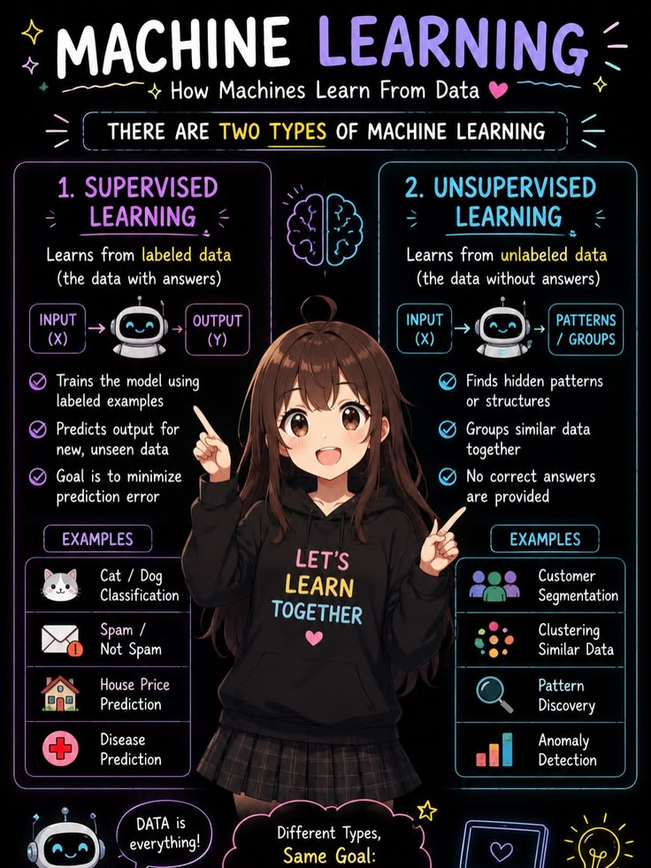
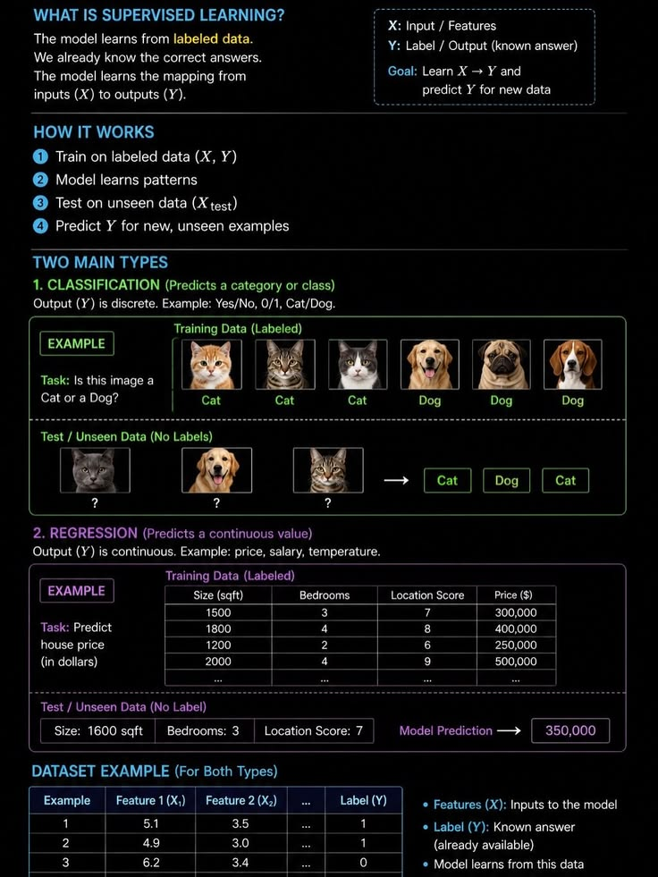
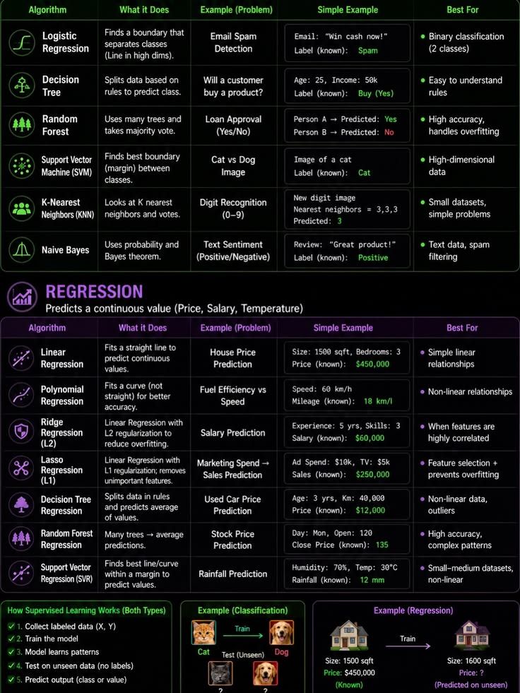

#Starting from Day 1:
##Define Machine learning:
Machine Learning is the subset of AI that deals with the training of a machine to take decision based upon the data.

##Simple language
Understand machine Learning as a student and yourself is a teacher. As a teacher your goal is to teach a student so that he can perform well in examination.
Similar is machine learning here our motive is to teach machines to work as per the condition provided.

##Types of Machine Learning
So types are given based on the quality of data:

<h2>Supervised Learning: </h2>Supervised learning is the type of ML where the data provided is purely labelled and understandable.
Example of this is a classroom where ranker students are seated and students are classified based on their performance.
Here the labels are student performance

<h2>Unsupervised Learning:</h2> Unsupervised learning is the type of ML where the data provided is not labelled and we have to first work upon data find patterns and execute it.

Example: A class having both weak and strong students so here data is scattered and on clustering we can obtain the classification of data

