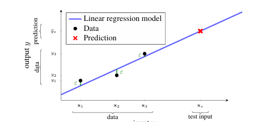

<h1>Supervised Learning</h1>
Day-2 goal is towards learning Supervised learning.
As we learnt Supervised learning is fully based on labelled data. Today we will go some advanced towards supervised learning.
Supervised learning is fully based upon classification and regression model. Today we will go towards learning Regression and its types.

  
| Regression Type          | Purpose                                                        | Key Use Cases                                |
|--------------------------|----------------------------------------------------------------|----------------------------------------------|
| Linear Regression        | Models straight-line relationships between dependent and independent variables | Predicting house prices, revenue forecasting |
| Polynomial Regression    | Extends linear regression with polynomial terms to capture non-linear trends | Growth curves, physics experiments           |
| Logistic Regression      | Despite its name, used for classification (binary/multi-class outcomes) | Spam detection, disease diagnosis            |
| Ridge Regression         | Adds L2 regularization to reduce overfitting                   | Stock price prediction with many correlated features |
| Lasso Regression         | Adds L1 regularization, shrinking coefficients and performing feature selection | Sparse datasets, gene expression analysis    |
| ElasticNet Regression    | Combines L1 and L2 penalties for balance                       | Text classification, marketing analytics     |
| Stepwise Regression      | Automatically adds/removes predictors based on statistical significance | Medical research, econometrics               |
| Decision Tree Regression | Splits data into regions with tree-based rules                 | Predicting sales, energy consumption         |
| Random Forest Regression | Ensemble of decision trees for robust predictions              | Weather forecasting, risk modeling           |
| Support Vector Regression| Uses support vector machines for regression tasks              | Financial time series, signal processing     |
| Bayesian Regression      | Incorporates prior distributions for probabilistic predictions | Medical trials, uncertainty modeling         |
| Quantile Regression      | Predicts conditional quantiles instead of mean                 | Income distribution, risk assessment         |

  

<h1><b><u>Linear Regression</u></b></h1>
The linear regression model describes the output variable y (a scalar) as an affine combination of the input
variables x1,x2,...,xp (each a scalar) plus a noise term ε,
            
            y =β0+β1x1+β2x2 +···+βpxp +ε.

We refer to the coefficients β0,β1,...βp as the parameters in the model, and we sometimes refer to β0
specifically as the intercept term. The noise term ε accounts for non-systematic, i.e., random, errors
between the data and the model. The noise is assumed to have mean zero and to be independent of x.
Machine learning is about training, or learning, models from data.\
Hence, the main part of today session is to
be devoted to how to learn the parameters β0,β1,...,βp from some training dataset  
n 
                                T = {(xi,yi)} 
i=1. 

The linear regression model can namely be used for, at least, two different purposes:
to describe relationships in the data by interpreting the parameters β = [β0 β1 ... βp]T, and to predict
future outputs for inputs that we have not yet seen.

<h1><b><u>Describe relationships — classical statistics</u></b></h1>
An often posed question in sciences such as medicine and sociology, is to determine whether there is a
correlation between some variables or not (‘do you live longer if you only eat sea food?’, etc.). Such
questions can be addressed by studying the parameters β in the linear regression model, after the parameter
has been learned from data. The most common question is perhaps whether it can be indicated that some
correlation between two variables x1 and y exists, which can be done with the following reasoning: If
β1 = 0,it would indicate that there is no correlation between y and x1 (unless the other inputs also depend
on x1). By estimating β1 together with a confidence interval (describing the uncertainty of the estimate),
one can rule out (with a certain significance level) that x1 and y are uncorrelated if 0 is not contained in
the confidence interval for β1. The conclusion is then instead that some correlation is likely to be present
between x1 and y. This type of reasoning is referred to as hypothesis testing and it constitutes an important
branch of classical statistics. However, we shall mainly be concerned with another purpose of the linear
regression model, namely to make predictions.
<h1><b><u>Predicting future outputs — machine learning</u></b></h1>
In machine learning, the emphasis is rather on predicting some (not yet seen) output y for some new
input x = [x1 x2 ... xp]T. To make a prediction for a test input x , we insert it into the model .
Since ε (by assumption) has mean value zero, we take the prediction as:  
y =β(0)+β(1)x(1)+β(2)x(2)+···+β(p)x(p).
 
We use the symbol on y to indicate that it is a prediction, our best guess. If we were able to somehow
observe the actual output from x , we would denote it by y (without a hat)

