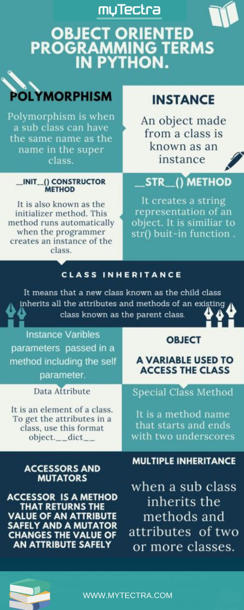
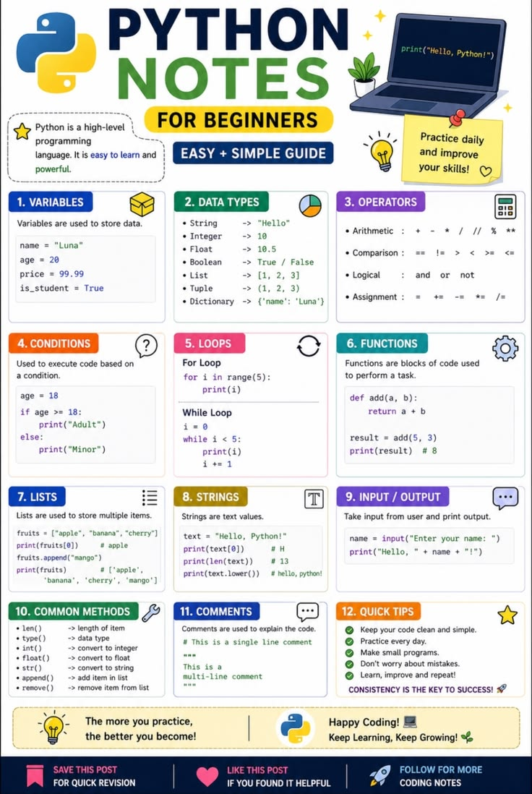

Object-Oriented Programming (OOP) in Python is a way of structuring code using classes and objects so that programs become easier to understand, reuse, and scale. Think of it as modeling real-world things (like a Car or Student) inside your code, where each object has data (attributes) and actions (methods).

Class: A blueprint for creating objects.

Object: An instance of a class.

Encapsulation: Grouping data (attributes) and behavior (methods) together inside a class.

Inheritance: A class can reuse features of another class.

Polymorphism: Different classes can define the same method but behave differently.

Abstraction: Hiding complex details and showing only the necessary parts.

